# FlickNFit Backend - Entity Relationship Diagram

## 📊 Database ERD

```mermaid
erDiagram
    %% Core User Management
    users ||--o{ saved_items : "has"
    users ||--o{ favorites : "has"
    users ||--o{ user_wardrobes : "has"
    users ||--o{ body_scan_histories : "has"
    users ||--o{ face_scan_histories : "has"
    users ||--o{ product_clicks : "tracks (optional)"
    users ||--o{ reviews : "writes"

    %% Product Management
    brands ||--o{ products : "owns"
    products ||--o{ product_items : "has variants"
    products ||--o{ product_categories : "belongs to"
    products ||--o{ product_styles : "has styles"
    products ||--o{ reviews : "receives"
    products ||--o{ product_clicks : "tracked"

    %% Product Variants & Configurations
    product_items ||--o{ product_configurations : "configured by"
    product_items ||--o{ saved_items_items : "saved in"
    product_items ||--o{ favorites : "favorited"
    product_variations ||--o{ product_variation_options : "has options"
    product_variation_options ||--o{ product_configurations : "used in"

    %% SavedItems (Cart)
    saved_items ||--o{ saved_items_items : "contains"

    %% Analytics
    brands ||--o{ product_clicks : "tracked"

    %% ========== ENTITY DEFINITIONS ==========

    users {
        uint64 id PK
        string email UK "unique, not null"
        string username UK "unique, not null"
        string password "nullable for OAuth"
        string phone_number "optional"
        enum gender "male, female, other"
        datetime birthday "nullable"
        string region
        enum role "admin, user"
        enum auth_provider "local, google, facebook"
        string auth_provider_id "Google/FB ID"
        string profile_picture_url
        boolean is_email_verified
        datetime last_login
        string refresh_token
        datetime refresh_token_expired_at
        string otp
        datetime otp_expired_at
        string reset_token
        datetime reset_token_exp_at
        datetime created_at
        datetime updated_at
    }

    brands {
        uint64 id PK
        string name "not null"
        string description "not null"
        float64 rating "default 0.0"
        uint reviewer "default 0"
        string logo_url
        string website_url
        uint total_products "default 0"
        string whatsapp_number "max 20"
        string instagram_url "max 255"
        string tokopedia_url "max 255"
        string shopee_url "max 255"
        datetime created_at
        datetime updated_at
    }

    products {
        uint64 id PK
        uint64 brand_id FK "not null"
        string name "not null"
        string description "not null"
        float64 discount "not null"
        float64 rating "default 0.0"
        int reviewer "default 0"
        int sold "default 0"
        string brand_product_url "max 512"
        text whatsapp_template "custom WA message"
        string instagram_product_url "max 255"
        string tokopedia_product_url "max 255"
        string shopee_product_url "max 255"
        datetime created_at
        datetime updated_at
    }

    product_items {
        uint64 id PK
        uint64 product_id FK "not null"
        string sku UK "max 20, unique"
        int price "not null"
        int stock "not null"
        int sold "default 0"
        string photo_url "max 255"
        datetime created_at
        datetime updated_at
    }

    product_configurations {
        uint64 product_item_id PK,FK
        uint64 product_attribute_value_id PK,FK
        datetime created_at
        datetime updated_at
    }

    product_variations {
        uint64 id PK
        string name "max 50, e.g. Color, Size"
        datetime created_at
        datetime updated_at
    }

    product_variation_options {
        uint64 id PK
        uint64 product_attribute_id FK "variation_id"
        string value "e.g. Red, XL"
        datetime created_at
        datetime updated_at
    }

    product_categories {
        uint64 id PK
        uint64 product_id FK
        string category "e.g. Tops, Bottoms"
        datetime created_at
        datetime updated_at
    }

    product_styles {
        uint64 id PK
        uint64 product_id FK
        string style "e.g. Casual, Formal"
        datetime created_at
        datetime updated_at
    }

    saved_items {
        uint64 id PK
        uint64 user_id FK "not null"
        datetime created_at
        datetime updated_at
    }

    saved_items_items {
        uint64 id PK
        uint64 saved_items_id FK "not null"
        uint64 product_item_id FK "not null"
        int quantity "not null, default 1"
        datetime created_at
        datetime updated_at
    }

    favorites {
        uint64 id PK
        uint64 user_id FK "not null"
        uint64 product_item_id FK "not null"
        datetime created_at
        datetime updated_at
    }

    user_wardrobes {
        uint64 id PK
        uint64 user_id FK "not null"
        uint64 product_item_id FK "not null"
        string photo_url
        datetime purchase_date
        datetime created_at
        datetime updated_at
    }

    reviews {
        uint64 id PK
        uint64 user_id FK "not null"
        uint64 product_id FK "not null"
        int rating "1-5, not null"
        text review_text "not null"
        datetime created_at
        datetime updated_at
    }

    product_clicks {
        uint64 id PK
        uint64 user_id FK "nullable - anonymous tracking"
        uint64 product_id FK "not null, indexed"
        uint64 brand_id FK "not null, indexed"
        datetime clicked_at "indexed"
        string ip_address "max 45 - IPv6"
        text user_agent
        datetime created_at
        datetime updated_at
    }

    body_scan_histories {
        uint64 id PK
        uint64 user_id FK "not null"
        string scan_name "max 100"
        string body_type "not null"
        string gender "max 10 - woman/man"
        string image_path "max 512, encrypted"
        json style_recommendations "array"
        decimal confidence "5,4 precision"
        datetime created_at
        datetime updated_at
    }

    face_scan_histories {
        uint64 id PK
        uint64 user_id FK "not null"
        string scan_name "max 100"
        string skin_tone "not null"
        string image_path "max 512, encrypted"
        json color_recommendations "array"
        decimal confidence "5,4 precision"
        datetime created_at
        datetime updated_at
    }
```

---

## 🔑 Key Relationships

### **User-Centric**
- ✅ **1 User → N SavedItems** - User memiliki 1 saved items container
- ✅ **1 SavedItems → N SavedItemsItems** - Container berisi many product items
- ✅ **1 User → N Favorites** - User bisa favorite banyak product items
- ✅ **1 User → N ProductClicks** - User activity tracking (nullable for anonymous)
- ✅ **1 User → N BodyScanHistories** - AI scan history
- ✅ **1 User → N FaceScanHistories** - Color tone analysis

### **Product Hierarchy**
- ✅ **1 Brand → N Products** - Brand memiliki many products
- ✅ **1 Product → N ProductItems** - Product punya variants (warna, ukuran)
- ✅ **1 ProductItem → N Configurations** - Variant configuration (Red + XL)
- ✅ **1 ProductVariation → N Options** - e.g., Color → [Red, Blue, Green]

### **E-Commerce Flow**
- ✅ **ProductItem ↔ SavedItemsItems** - Items in cart
- ✅ **ProductItem ↔ Favorites** - Favorited items
- ✅ **Product ↔ Reviews** - Product reviews

### **Analytics & Tracking**
- ✅ **ProductClick → Product** - Which product clicked
- ✅ **ProductClick → Brand** - Which brand benefited
- ✅ **ProductClick → User** - Who clicked (optional/anonymous)

---

## 📝 Notes

### **Encrypted Fields** 🔐
- `body_scan_histories.image_path` - AES-256-GCM encrypted
- `face_scan_histories.image_path` - AES-256-GCM encrypted

### **JSON Fields** 📦
- `body_scan_histories.style_recommendations` - Array of style suggestions
- `face_scan_histories.color_recommendations` - Array of color palettes

### **Nullable Foreign Keys** 🔓
- `product_clicks.user_id` - Supports anonymous tracking for viral growth
- `users.password` - OAuth users don't need password

### **Multi-Platform Links** 🔗
- Brands: `whatsapp_number`, `instagram_url`, `tokopedia_url`, `shopee_url`
- Products: `brand_product_url`, `whatsapp_template`, platform URLs

### **Indexes** ⚡
- `product_clicks.product_id`, `brand_id`, `clicked_at` - Analytics performance
- `users.email`, `username` - Unique constraints

---

## 🎯 Design Decisions

1. **SavedItems vs Cart** - Renamed to reflect discovery platform (not checkout)
2. **ProductClick Anonymous** - Nullable `user_id` for viral sharing
3. **Product Multi-Platform** - Support UMKM across multiple channels
4. **Encrypted Scans** - Privacy-first for sensitive body/face images
5. **ProductItem as Variant** - Each color+size combination = unique item

---

**Generated:** December 2, 2025  
**Total Tables:** 18  
**Total Relationships:** 25+
